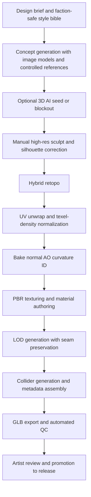
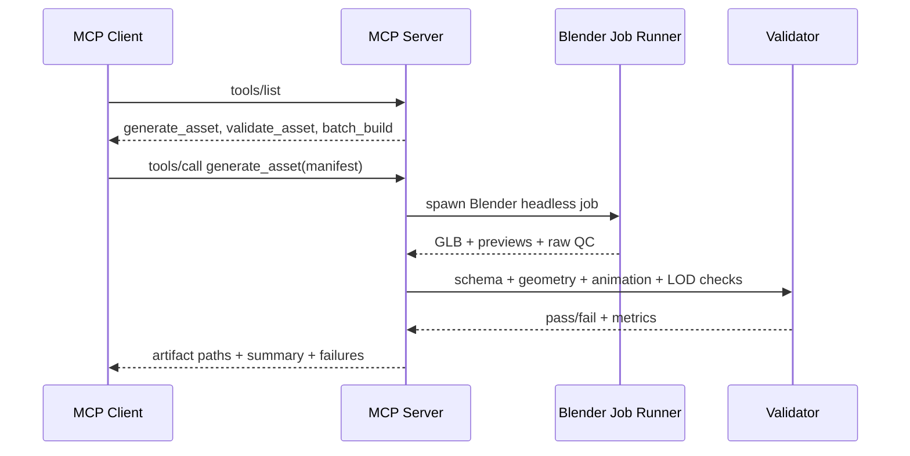
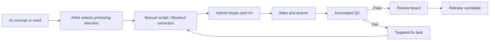

# AI-Driven Modular 3D Asset Pipeline Blueprint for a Dark-Fantasy Game

## Executive summary

Your uploaded `blender-character-pipeline.zip` is already a useful foundation, but it is not yet a full production-grade modular asset system. From direct inspection of the archive, the current stack is best described as a **procedural Blender generation pipeline with an MCP wrapper**, plus glTF export and lightweight post-export validation. It already has several good habits: a clear runtime/export coordinate convention, same-origin overlay passes for modular armor experiments, named animation clips, and a Node/Three.js-based GLB validation step. The biggest gaps are also clear: **slot and attachment logic are still partly name-driven instead of manifest-driven, armor overlays are not yet consistently authored as animation-ready skinned modules, there is no full asset metadata schema, collision/LOD/QC are comparatively thin, and there is no true AI-assisted authoring stage yet**. That means the correct next step is not “replace the pipeline,” but **formalize it into a manifest-first blueprint system** and then add AI only where it increases throughput without damaging topology, deformation quality, or IP safety.

For engine-agnostic runtime delivery, glTF/GLB is a strong default because the format is explicitly defined as right-handed, +Y-up, +Z-forward, meter-based, and built around PBR metallic-roughness materials. The spec also makes clear that top-level object `name` values are optional and not guaranteed to be unique, which is why your pipeline should treat names as human-readable labels only and move all authoritative asset semantics into structured metadata. citeturn3view3

The most robust architecture for your game is a **blueprint + manifest + generated-artifacts** approach. In practical terms, each armor, weapon, and jewel piece should exist as a versioned authoring asset plus a machine-readable manifest that defines slot occupancy, anchor points, skeleton compatibility, LOD chain, collider policy, material channels, scale class, and QC thresholds. Blender should be the reference DCC, but the authoritative rules should live outside the `.blend` file so that MCP, CI, and batch tooling can reason about assets deterministically.

AI should be used **selectively**. The newest open 3D models such as TRELLIS, Hunyuan3D 2.0, and TripoSG can produce high-quality 3D seeds or textured drafts, but they are still much better suited to **ideation, shape exploration, and rough blockout** than to final modular game assets with reliable deformation topology, seam-safe LODs, and consistent attachment semantics. ControlNet-style image conditioning is useful upstream for concept generation and orthographic guidance, while final sculpting, retopology, UVs, skinning, and material polish still require either human control or tightly bounded automation. citeturn28view9turn12search0turn28view7turn12search1turn28view8turn12search3

Because your brief is “loosely inspired by Warhammer Fantasy,” the safest legal and production strategy is to extract **design principles**, not protected expressions. Copyright protects expression rather than abstract ideas or methods, while trademark law protects names, logos, and source-identifying signs. In plain terms: “dark late-medieval fantasy armor with exaggerated silhouette and religious-gothic ornament” is a style direction; copying named factions, heraldry, iconography, signature silhouettes, or near-verbatim faction/character designs is where risk rises sharply. citeturn29search1turn29search3turn29search0turn29search12

Several important details remain unspecified in your request, and they materially affect exact budgets: target platform class, camera distance, target framerate, memory budget, animation count per asset family, and whether cloth is runtime-simulated or baked. The ranges below should therefore be treated as **production starting points**, not immutable absolutes.

## Audit of the uploaded Blender pipeline and MCP server

### What the current upload appears to do

From direct inspection of your archive, the current system consists of:

- Blender Python generators for characters, modular humanoid bodies, armor overlays, static assets, and animation assembly.
- A Node-based MCP server that launches Blender headlessly, exposes generation tools, and performs post-export validation by loading produced GLBs in Three.js.
- A strong emphasis on exporting game-facing GLB files and keeping runtime assets upright through a Y-up authoring convention normalized through Blender export.
- Experimental modular armor overlays that share origin and neutral pose with a base body, but are not yet uniformly implemented as fully skinned production modules.
- Hero-pipeline metadata tags in some scripts, but not yet a generalized manifest schema that controls every asset category.

That architecture is compatible with MCP’s tool model and stdio transport, where the client launches the server as a subprocess and exchanges newline-delimited JSON-RPC messages over stdin/stdout. MCP’s specification also recommends configurable request timeouts and clean stdio shutdown, both of which matter for long-running Blender jobs. citeturn26view0turn26view1turn26view3

### Audit checklist for the Blender side

The most useful way to audit your current Blender pipeline is to inspect it in six layers rather than file-by-file.

**Authoring-space invariants.** Verify that every generator and every source `.blend` uses one canonical character scale, one neutral bind pose, one authoritative armature naming standard, and one export normalization path. Because glTF is meter-based and +Y-up, every export path should preserve those invariants at the runtime boundary. Any asset whose feet do not land close to `Y=0`, or whose world scale changes after export/import, should fail CI immediately. citeturn3view3

**Mesh integrity.** Check for non-manifold geometry, inverted normals, zero-area faces, duplicate vertices at seams, hidden negative scales, and disconnected loose islands. Auto-retopo and procedural mesh assembly are common sources of hidden topology defects, especially where rigid armor intersects cloth or straps.

**Material and texture correctness.** Confirm that authored materials map cleanly to glTF metallic-roughness expectations, that tangent-space normals follow the glTF convention, and that texture channels are exported consistently. glTF’s PBR model is metallic-roughness; normal maps are tangent-space textures with a defined component convention. citeturn3view3

**Skinning and animation compatibility.** Check shared skeleton compatibility across the base body and every modular slot piece, verify that weight normalization and influence limits are enforced, and ensure animation clips survive round-trip export with correct names and loop semantics.

**Modularity.** Inspect whether slot occupancy, anchor points, and piece compatibility are encoded as data or inferred from object names. In your current upload, this is one of the major design risks: name-driven logic is fast to prototype, but fragile at production scale.

**Export and validation.** Audit the post-export validation layer to ensure it checks not just bounds and file existence, but also hierarchy, animation presence, bone counts, texture references, material channel completeness, collider metadata, LOD completeness, and schema conformance.

### Common failure modes to expect

The most common failure mode in systems like this is **coordinate drift across authoring, export, and runtime validation**. Your own README already shows that you have been dealing with Y-up/Z-up normalization, and that is the right place to stay strict. If any sub-pipeline skips the same normalization utility, the asset may still “look right” in DCC while being rotated, offset, or grounded incorrectly in-engine. glTF is explicit about orientation and units, so the pipeline should be equally explicit. citeturn3view3

The next failure mode is **semantic drift caused by name-based inference**. glTF object names are not guaranteed to be unique, and MCP tools are schema-based by design. If a slot, anchor, or material class is inferred from a mesh name instead of read from validated metadata, then renames, artist variants, and auto-generated drafts become a source of silent bugs. citeturn3view3turn26view0

A third failure mode is **bind-pose-only modularity**. Your current archive includes same-origin armor overlays that are useful for fit checks, but a fit-check overlay is not the same thing as a runtime-ready skinned module. The moment shoulder rotations, cloth interactions, and cape motion enter the system, copied weights and shared skeleton compatibility are mandatory. Blender’s armature skinning tools include automatic weighting, but those results are only a starting point, not a final guarantee of production-quality deformation. citeturn6search3turn6search7

A fourth failure mode is **under-instrumented validation**. Your current server-side validation is useful, but if it only measures bounds, mesh counts, and basic animation presence, it will miss the failures that actually cost time in content production: broken vertex groups, UV overlaps in unique-bake regions, texture channel omissions, collider excess, and LOD seam mismatch. For modular characters, Simplygon explicitly calls out that independent optimization can introduce gaps and mismatched normals unless seams are preserved. That warning applies conceptually even if you do not use Simplygon itself. citeturn28view0turn28view1

### Metrics to measure during audit

A practical audit should record a small, stable metric set for every asset build.

| Metric class | Minimum fields to record | Suggested pass rule |
|---|---|---|
| Transform | world bounds, origin, ground contact, scale factor, forward axis | feet/base within 2 cm of expected ground plane; no unexpected axis rotation |
| Geometry | verts, tris, ngons, non-manifold edges, zero-area faces, loose parts | non-manifold = 0; zero-area = 0; loose parts intentional only |
| UVs | island count, overlap ratio, texel density, padding, mirrored regions | unique-bake regions overlap-free; padding meets atlas target |
| Materials | material slots, texture sets, channel completeness, shader class | all required PBR channels present per asset class |
| Rigging | bone count, weighted vertex ratio, max influences, normalized weights | 100% weighted; max runtime influences obey target |
| Animation | clip names, clip lengths, root motion policy, retarget profile | every required clip present and named consistently |
| Physics | collider count, primitive types, estimated cost class | collider budget per slot not exceeded |
| Runtime | draw calls, texture memory, payload size, LOD availability | platform budget not exceeded; no missing LOD metadata |

The reason to keep these metrics narrow is that they can be enforced automatically in Blender Python, in Node after GLB export, or in CI with external analyzers such as `gltfpack`, `xatlas`, or your own mesh scripts. `gltfpack` is specifically designed to optimize glTF for size and runtime speed, while `xatlas` generates unique texture coordinates suitable for baking and texture painting. citeturn28view2turn28view4

## Blueprint templates for armor, weapons, and jewels

### Canonical authoring rules

The pipeline should define one **canonical runtime-facing frame** and one **canonical authoring pose**.

Use the exported/runtime convention as authoritative:

- **Units:** meters.
- **Runtime axes:** right-handed, +Y up, +Z forward.
- **Character origin:** armature root centered on the pelvis projection to ground plane.
- **Neutral pose:** A-pose preferred for armor and cloth, with hands open and weapon-free.
- **Body baseline:** current uploaded mannequin/body system appears to target a tall broad-shouldered humanoid around 1.95–2.0 m; if you keep that, keep it explicit in metadata.

These choices align directly with glTF’s coordinate and unit conventions and make downstream engine integration much less ambiguous. citeturn3view3

### Recommended naming convention

Because glTF names are not guaranteed unique, your naming convention should be **human-readable but non-authoritative**. The authoritative identity should live in metadata.

Use this pattern:

```text
<category>_<family>_<slot>_<variant>_<material>_<tier>_<sexOrBody>_<version>
```

Examples:

```text
arm_human_chest_blackenedsteel_t2_m_v003
arm_human_shoulder_oathbound_t1_m_v001
wep_sword_1h_bastard_iron_t2_v004
wep_hammer_2h_reliquary_steel_t3_v002
jwl_amulet_obsidian_gilded_t2_v001
jwl_ring_bloodstone_ornate_t1_v003
```

Then store authoritative IDs separately:

```json
{
  "assetId": "arm.human.chest.blackenedsteel.t2.m",
  "displayName": "Blackened Steel Cuirass",
  "version": "0.3.0"
}
```

This matters because glTF allows object names for display/app use, but does not require uniqueness. Metadata must therefore carry the reliable slot and compatibility semantics. citeturn3view3

### Attachment and anchor point matrix

All anchor points should exist both as **named metadata records** and as either bones or empties/nulls in Blender.

| Anchor name | Asset family | Parent | Purpose |
|---|---|---|---|
| `AP_ROOT` | all | `root` | same-origin overlays, global alignment |
| `AP_PELVIS_FRONT` | armor, tabards, belts | pelvis/root | belts, front cloth, codpieces, faulds |
| `AP_PELVIS_BACK` | armor, capes | pelvis/root | rear drapes, cape lower stabilizer |
| `AP_SPINE_CHEST` | armor | chest/spine_03 | cuirass, gorget, chest ornaments |
| `AP_CLAV_L` / `AP_CLAV_R` | armor | clavicles | pauldrons, mantle flanges |
| `AP_ARM_UPPER_L/R` | armor | upperarm | couters, rerebraces |
| `AP_ARM_LOWER_L/R` | armor | forearm | bracers, vambraces |
| `AP_HAND_WEAPON_R` | weapons | hand.R | primary one-hand weapon grip |
| `AP_HAND_WEAPON_L` | weapons | hand.L | shield or off-hand weapon grip |
| `AP_HAND_SECONDARY_R/L` | weapons | hand | second grip target for two-handed weapons |
| `AP_BACK_L` / `AP_BACK_R` | weapons | spine/chest | sheathed weapons, banner poles |
| `AP_HIP_L` / `AP_HIP_R` | weapons, pouches | pelvis | scabbards, daggers, charms |
| `AP_NECK_CENTER` | jewels | neck/head junction | amulets, pendants |
| `AP_RING_L_01...05` | jewels | finger bones | rings |
| `AP_RING_R_01...05` | jewels | finger bones | rings |
| `AP_BROOCH_CHEST` | jewels | chest | brooches, reliquaries |
| `AP_EAR_L/R` | jewels | head | earrings |
| `AP_CROWN_FRONT` | jewels | head | circlets, forehead gems |
| `AP_FX_*` | any | varies | muzzle flashes, glow points, gem pulses |

Rules:

- **Skinned body-worn modules** use `AP_ROOT` for object origin and named attachment records for semantics.
- **Handheld weapons** place local origin at the primary grip, not at world origin.
- **Two-handed weapons** define both a primary-grip origin and a secondary-grip marker.
- **Jewels** are usually rigid attachments with a local pivot at the clasp, hook, or centerline mount, depending on subtype.

### Pivot and origin rules

For modular interchangeability, the safest rules are:

- **Skinned armor modules:** object origin at root, zeroed transforms, same bind pose as the base body.
- **Rigid body attachments worn on skeleton sockets:** origin at attachment socket center.
- **One-handed weapons:** origin at the dominant grip center, blade forward in +Z, crossguard plane aligned to +X.
- **Two-handed weapons:** origin at rear/primary grip; define `secondaryGripOffset`.
- **Jewels:** origin at visible hanging point or clasp if simulated; at center of mount if rigid.

Do not allow artists to choose pivots ad hoc. Pivot inconsistency is one of the fastest ways to break batch placement, hand-socket matching, and retargeted attack animations.

### Topology, tri-flow, and edge-loop rules

The topology standard should distinguish between **deformation zones**, **hinge zones**, and **rigid zones**.

For **deformation zones** such as shoulders, elbows, wrists, hips, knees, neck base, and cloth pin regions:

- Prefer all-quads.
- Maintain readable edge loops around the bending axis.
- Use loop density to describe bending, not decorative ridges.
- Keep armor shell openings aligned with the underlying body loops where the shell must follow deformation.

For **hinge zones** such as articulated plate elbows, poleyns, and faulds:

- Separate rigid plates from flexible connectors.
- Let loops terminate in the connector material, not across hard-surface plates.
- Support folds with geometry only where silhouette changes are camera-visible; otherwise bake them.

For **rigid zones** such as breastplates, sword guards, hammer heads, jewel bezels:

- Triangles are acceptable away from deformation.
- Preserve clean shading and explicit hard-surface support edges.
- Avoid long spiraling loops that complicate UVs and normal baking.

Auto-retopo can help, but use it as a first pass. Instant Meshes is an interactive field-aligned meshing tool tied to the *Instant Field-Aligned Meshes* publication, and QuadriFlow is specifically a quadrangulation method; both are useful for draft retopo, but neither should be trusted blindly for production deformation topology at shoulders, fingers, straps, or cloth pins. citeturn28view5turn28view6

### UV layout standards

Use one UV set for material texturing by default, and add a second only if your eventual engine or baking workflow truly requires it.

Recommended standards:

- Keep **texel density normalized by class**, not by individual artist preference.
- Favor **symmetry only where needed**; do not mirror hero wear patterns unless style requires it.
- Split UV islands on hard edges and hidden seams, not across visible silhouette landmarks.
- Reserve unique bake space for emblem plates, focal gemstones, and high-visibility weapon heads.
- Maintain consistent padding per bake resolution.

A solid starting point:

| Asset type | Suggested texel density | Typical atlas strategy |
|---|---|---|
| Major armor pieces | 768–1024 px/m | 1–2 shared armor sets per full outfit |
| Hero weapons | 1024–1536 px/m | 1 dedicated set per weapon |
| Small jewels | 1536–2048 px/m | shared jewelry atlas by material family |
| Background variants | 512–768 px/m | shared atlas across faction/material family |

For automation, `xatlas` is a practical open-source unwrap library for unique texture coordinates suitable for baking or painting, while RizomUV remains one of the more production-friendly commercial UV tools. RizomUV’s current releases emphasize faster GPU packing and workflow refinements; `xatlas` is lightweight and easy to embed into pipeline automation. citeturn28view4turn20search2turn20search11

### LOD and interchangeability blueprint

For this game’s target look, I recommend a **silhouette-first LOD policy**:

- LOD0 preserves hero silhouette, clear faction read, and primary material breakup.
- LOD1 removes sub-surface bevel geometry, interior backfaces, tiny rivets, and non-silhouette straps.
- LOD2 merges thin layers, simplifies cloth folds, and collapses secondary ornament.
- LOD3 becomes readability-only: broad silhouette, large normals, no micro-ornament geometry.

A useful starting reduction strategy for modular assets:

| Asset class | LOD0 | LOD1 | LOD2 | LOD3 |
|---|---:|---:|---:|---:|
| Chest / torso module | 100% | 65–75% tris | 35–45% tris | 15–25% tris |
| Shoulder pair | 100% | 70–80% | 40–50% | 20–30% |
| One-handed weapon | 100% | 70–80% | 45–55% | 20–30% |
| Two-handed weapon | 100% | 75–85% | 50–60% | 25–35% |
| Jewel / amulet | 100% | 60–75% | 30–40% | billboard or omit |

For modular characters, preserve boundary seams across pieces during reduction. Simplygon explicitly notes that modular seam-aware optimization prevents gaps and mismatched normals after reduction, which is exactly the problem you want to avoid on pauldron-to-cuirass, belt-to-tabard, and boot-to-greave boundaries. Even if you stay open-source, the policy should be the same: **reduce modular pieces with seam constraints, not in isolation without awareness of neighbors**. citeturn28view0turn28view1

Interchangeability rules should be strict:

- A slot piece must declare which other slots it occludes.
- An opaque outer plate must also declare body hide masks.
- A piece may not assume neighboring slot geometry exists.
- Every skinned module in a body family must share the same skeleton definition and bind pose.
- Every module in a family must pass seam alignment tests against a canonical body and at least one neighboring module from each adjacent slot.

### Example dimensions and scale starting ranges

These are good production starting points for a tall dark-fantasy human male frame comparable to your current archive’s broad-shouldered mannequin:

| Item | Typical dimension |
|---|---|
| Character height | 1.95–2.00 m |
| Shoulder width | 0.78–0.84 m |
| One-handed arming sword | 0.90–1.05 m overall |
| Bastard sword | 1.10–1.25 m |
| Greatsword | 1.35–1.55 m |
| Warhammer one-hand | 0.65–0.85 m |
| Polehammer / two-hand hammer | 1.20–1.50 m |
| Shield small | 0.50–0.65 m tall |
| Shield kite/heater large | 0.75–1.05 m tall |
| Necklace pendant | 0.04–0.08 m |
| Ring outer diameter | 0.022–0.030 m |
| Circlet height | 0.03–0.06 m |

Because platform targets are unspecified, use these as baselines and then tighten them against camera tests rather than treating them as canonical.

## Rigging, animation, collision, and physics constraints

### Rigging and skinning rules

Use one **canonical humanoid skeleton per body family** and never let slot assets invent their own bone names. In Blender, armature skinning and automatic weights are legitimate starting tools, but production modules need deterministic cleanup after auto-weighting. citeturn1search14turn6search3turn6search7

Recommended runtime constraints:

- Max influences per vertex: **4** for shipping builds.
- Normalize all weights.
- No unweighted vertices.
- Rigid armor plates: one dominant bone plus controlled feathering at seams.
- Flexible connectors and padded underlayers: smooth multi-bone blends.
- Cloth proxies: separate low-res sim mesh, render mesh driven by surface deform/cage.

For hard-surface armor, think in terms of **structured rigidity**:

- Pauldrons: mostly clavicle/upperarm driven, small chest contribution.
- Cuirass: mostly spine and chest, nearly rigid.
- Bracers: forearm/hand blend only at wrist edges.
- Greaves: calf/foot blend only near ankle.
- Belts/faulds: pelvis dominant, slight thigh contribution only on flexible panels.

### Weight painting and deformation checklist

A good armor module should pass all of these tests:

| Test | Pass condition |
|---|---|
| Rest-pose fit | no clipping against canonical body |
| Shoulder raise | pauldrons clear neck and cuirass |
| Elbow flex | bracer/couter overlap remains plausible |
| Hip flex | faulds and belt attachments do not explode |
| Knee bend | greave silhouette remains stable |
| Attack windup | weapon grip remains aligned to hand socket |
| Death/fall pose | no detached pieces or inverted normals |

For QC, add automated pose sweeps: sample 10–20 canonical stress poses and run nearest-surface penetration tests between modules and body.

### Joint limits and retargeting policy

You want a skeleton that survives retargeting, so keep the bind pose, bone orientation, and twist-chain strategy consistent across all variants.

Reasonable starting joint-limit recommendations:

- Neck yaw: ±60°
- Neck pitch: +35° / -45°
- Upper spine twist per segment: ±20–35°
- Shoulder elevation: to roughly 100–120° depending on clavicle rig
- Elbow flexion: up to ~145°
- Wrist bend: ±40–50°
- Hip flexion: ~110°
- Knee flexion: ~130–145°
- Ankle dorsiflex/plantarflex: ~25° / ~45°

These are practical animation constraints, not legal or medical limits. The key production rule is consistency: if you retarget locomotion, attacks, and idles across careers or body variants, the skeleton contract must not drift.

Retargeting rules:

- Preserve root, pelvis, IK hand, IK foot, and weapon-socket markers.
- Store retarget map outside DCC in JSON.
- Keep weapon grip markers separate from visual mesh nodes.
- Validate foot sliding, hand drift, and root height after every retarget batch.

### Cloth, soft-body, and secondary motion

For a real-time modular pipeline, cloth should be **selective and layered**:

- Simulate only capes, tabards, loincloths, chains, tassels, and hanging jewelry.
- Keep breastplates, shields, swords, scabbards, and heavy jewels rigid.
- Use low-resolution cloth proxies with pinned vertices at anchor zones.
- Bake fallback animations for platforms or scenes where runtime cloth is disabled.

Painter and Toolbag support workflows that benefit from good baked curvature/AO inputs, and Sampler can support weathering material generation, but cloth realism still comes from geometry, skinning, and sim proxies rather than from textures alone. citeturn23view0turn24view2turn25view2

### Collision and hitbox blueprint

Separate **physics collision**, **navigation collision**, and **combat hitboxes**.

Recommended runtime defaults:

- **Body-worn armor:** attached to parent body collision; do not give every plate its own active rigid body.
- **Weapons:** carry/light idle collision and separate active attack hit volumes.
- **Jewels:** normally no active collision unless gameplay requires it.
- **Large shields, banners, scabbards:** optional blocking collision only if gameplay benefits.

Per-piece collider suggestions:

| Piece type | Runtime collider recommendation |
|---|---|
| Cuirass | single convex hull or chest-aligned box/hull |
| Pauldron | sphere or short capsule |
| Bracer | capsule |
| Belt/faulds | 2–4 capsules or thin hulls |
| Greave | capsule or tapered hull |
| Boots | foot box/capsule merged into lower-body set |
| One-hand sword | grip capsule + blade attack capsule/hull |
| Hammer | handle capsule + head hull |
| Shield | one broad hull for blocking, separate visual mesh |
| Pendant / amulet | sphere or no collision |
| Ring / earrings | no collision |

Performance rule of thumb: use the cheapest primitive that delivers acceptable gameplay. Complex moving triangle-mesh collision on equipment is rarely worth the runtime cost or debugging burden in an engine-agnostic character pipeline.

## AI-assisted generation pipeline and prioritized tool options

### Recommended pipeline design

The strongest AI-assisted pipeline for your use case is **hybrid**, not end-to-end generative.



The key principle is that AI helps most at the **exploration and acceleration** stages, while deterministic tooling handles the **shipping-critical** stages.

### Where to use AI and where not to

Use AI aggressively for:

- silhouette ideation,
- motif exploration,
- orthographic concept variants,
- rough 3D draft/blockout,
- material seed generation,
- weathering mask ideation,
- auto-tagging/QC triage.

Use AI cautiously for:

- final mesh topology,
- production UVs,
- skinning,
- seam-safe modular LODs,
- exact colliders,
- faction-defining hero assets.

That caution is grounded in the current state of open 3D models. TRELLIS explicitly targets versatile high-quality 3D asset creation across multiple output formats; Hunyuan3D 2.0 and TripoSG likewise target high-fidelity shape/textured generation. Those are impressive capabilities, but they do not eliminate the need for artist-controlled final geometry in a modular character pipeline. citeturn28view9turn12search0turn28view7turn12search1turn28view8

### Tool comparison table

The table below prioritizes official docs, original papers, and pipeline usefulness over hype.

| Stage | Preferred tools | Best role | Cost / license | Integration ease | Notes |
|---|---|---|---|---|---|
| DCC core | Blender | authoring, rigging, baking fallback, scripting | Free / open-source | High | Blender is free/open-source and covers the full 3D pipeline. citeturn0search6 |
| High-res sculpt | Blender Sculpt, ZBrush | hero sculpt, hard-surface refinement | Blender free; ZBrush commercial/subscription | High / Medium | ZBrush remains a dedicated high-detail sculpting tool; Blender is the best zero-cost baseline. citeturn18search2turn18search24 |
| AI 3D seed | Hunyuan3D 2.0, TripoSG, TRELLIS | concept/blockout, rapid variant generation | Open-source research / repo-based | Medium | Strong for draft geometry; not a substitute for final modular game topology. citeturn12search0turn28view7turn12search1turn28view8turn28view9 |
| Image control | diffusion + ControlNet | concept sheets, orthos, silhouette control | model-dependent | Medium | ControlNet is useful when you need reliable shape/pose conditioning. citeturn12search3turn12search11 |
| Retopology | Instant Meshes, QuadriFlow | first-pass retopo and quadrangulation | Open-source | Medium | Fast starting point; always review deformation zones manually. citeturn28view5turn28view6 |
| UV unwrap | Blender, xatlas, RizomUV | unwrap, packing, atlas automation | Blender free; xatlas MIT; RizomUV commercial | High / High / Medium | `xatlas` is especially attractive for automation; RizomUV is strong for artist throughput. citeturn28view4turn20search2turn20search11 |
| Texturing | Substance 3D Painter | final hero and production texturing | Commercial; Substance Collection currently listed at US$59.99/mo | High | Painter is positioned by Adobe as the go-to/industry-standard texturing app with real-time viewport and export presets. citeturn23view0 |
| Material generation | Substance 3D Sampler | image-to-material, scan cleanup, PBR seed generation | Commercial; included in Substance Collection | High | Sampler’s Image to Material generates high-quality PBR materials from a single image and can output albedo/roughness/normal/displacement-style channels. citeturn25view0turn25view2 |
| Baking | Marmoset Toolbag, Painter, Blender | high-quality bake production | Commercial / Commercial / Free | High / High / High | Toolbag is especially strong for high-res baking, skew correction, UDIM support, and tangent-space control. citeturn24view2 |
| LOD + optimization | gltfpack, meshoptimizer, Simplygon | GLB optimization, simplification, modular seam-safe LODs | Open-source MIT / Commercial | High / Medium | `gltfpack` is excellent for open automation; Simplygon is better for large-scale industrial optimization and modular seams. citeturn28view2turn28view3turn28view0turn28view1 |

### PBR material policy

For engine-agnostic delivery, design your material pipeline around a glTF-compatible metallic-roughness core:

- base color / albedo,
- roughness,
- metallic,
- normal,
- optional occlusion,
- optional emissive,
- optional opacity or mask where needed.

glTF defines materials around metallic-roughness and standardizes tangent-space normal expectations, which is one reason to keep your runtime material contract conservative even if internal DCC shaders are richer. citeturn3view3

For dark-fantasy readability, I recommend four master material families:

- **ferrous plate**,
- **leather/strap**,
- **cloth/tabard/cape**,
- **gem/relic/glow**.

Everything else should inherit from those with mask-driven variation. That keeps modular swapping visually coherent.

## Blender and MCP integration, metadata schema, and automation

### What to change in the current MCP design

Your current stdio MCP server is appropriate for local use, because MCP explicitly supports stdio and expects the client to launch the server as a subprocess. But for larger batches, long-running jobs, or CI, I recommend separating the system into:

- **MCP front-end server** for tool discovery and job submission,
- **job runner** for Blender execution,
- **artifact validator** for GLB/QC checks,
- **manifest registry** for asset definitions.

That recommendation aligns with MCP’s transport model and timeout guidance. Stdio is excellent for local orchestration, but heavy Blender jobs benefit from explicit timeout control, progress reporting, and the ability to move later to Streamable HTTP if you outgrow stdio. citeturn26view1turn26view3

### Recommended file and artifact contract

Use this authoring/runtime split:

| Layer | Primary format | Purpose |
|---|---|---|
| Authoring | `.blend` | editable source of truth for geometry, rig, materials |
| Manifest | `.asset.json` | slot/anchor/LOD/collider/QC metadata |
| Runtime model | `.glb` | engine-agnostic delivery |
| Textures | `.png` during production, optionally compressed runtime textures later | authoring and runtime |
| Preview | `.png` | review renders, QC |
| Logs | `.json` or `.ndjson` | batch and CI reporting |

`gltfpack` is a sensible post-export step when you want smaller and faster-loading GLB files. Khronos also highlights KTX v2 / Basis Universal as a glTF texture path for reducing asset size and GPU memory, though exact runtime adoption depends on the engine you eventually choose. citeturn28view2turn16search23

### Example asset metadata schema

Below is a compact schema pattern I recommend for every modular asset family.

```json
{
  "$schema": "https://example.com/schemas/asset-blueprint.schema.json",
  "assetId": "arm.human.chest.blackenedsteel.t2.m",
  "displayName": "Blackened Steel Cuirass",
  "category": "armor",
  "slot": "chest",
  "bodyFamily": "human_m_tall",
  "skeletonId": "humanoid_v1",
  "bindPoseId": "a_pose_v1",
  "authoringUnit": "meter",
  "runtimeFormat": "glb",
  "geometry": {
    "originRule": "same_origin_overlay_root",
    "forwardAxis": "+Z",
    "upAxis": "+Y",
    "lods": [
      {"name": "LOD0", "triTarget": 5200, "screenCoverageMin": 0.22},
      {"name": "LOD1", "triTarget": 3600, "screenCoverageMin": 0.12},
      {"name": "LOD2", "triTarget": 1900, "screenCoverageMin": 0.05},
      {"name": "LOD3", "triTarget": 850,  "screenCoverageMin": 0.02}
    ]
  },
  "attachments": [
    {"name": "AP_ROOT", "type": "root", "parent": "root", "position": [0,0,0]},
    {"name": "AP_SPINE_CHEST", "type": "socket", "parent": "spine_03", "position": [0,0.21,0.06]},
    {"name": "AP_CLAV_L", "type": "socket", "parent": "clavicle_l", "position": [-0.12,0.24,0.03]},
    {"name": "AP_CLAV_R", "type": "socket", "parent": "clavicle_r", "position": [0.12,0.24,0.03]}
  ],
  "materials": {
    "master": "MM_FerrousPlate",
    "textureSet": "armor_plate_t2",
    "channels": ["baseColor", "roughness", "metallic", "normal", "occlusion"]
  },
  "rigging": {
    "skinned": true,
    "maxInfluences": 4,
    "requiredBones": ["root", "pelvis", "spine_01", "spine_02", "spine_03", "clavicle_l", "clavicle_r"],
    "stressPoses": ["arms_up", "idle_twist", "forward_bend"]
  },
  "collision": {
    "policy": "compound_primitive",
    "primitives": [
      {"type": "convexHull", "tag": "body_blocker"},
      {"type": "sphere", "tag": "shoulder_clearance_l"},
      {"type": "sphere", "tag": "shoulder_clearance_r"}
    ],
    "hitboxPolicy": "inherits_body"
  },
  "compatibility": {
    "occupiesSlots": ["chest"],
    "occludesBodyMasks": ["torso_upper", "torso_mid"],
    "conflictsWith": ["cape_heavy_full"],
    "requires": []
  },
  "qc": {
    "allowUvOverlap": false,
    "allowNonManifold": false,
    "maxTextureResolution": 4096,
    "maxDrawCalls": 2
  },
  "provenance": {
    "createdBy": "artist",
    "aiAssisted": true,
    "aiStages": ["concept", "material_seed"],
    "referencePackId": "dark_fantasy_style_bible_v2"
  },
  "version": "0.3.0"
}
```

### Sample Blender Python pseudocode

#### Batch export and QC stub

```python
import bpy
import json
from pathlib import Path

def collect_mesh_stats(obj):
    mesh = obj.data
    tris = sum(len(p.vertices) - 2 for p in mesh.polygons)
    ngons = sum(1 for p in mesh.polygons if len(p.vertices) > 4)
    return {
        "verts": len(mesh.vertices),
        "edges": len(mesh.edges),
        "faces": len(mesh.polygons),
        "tris": tris,
        "ngons": ngons,
    }

def export_asset(manifest_path: str, output_glb: str):
    manifest = json.loads(Path(manifest_path).read_text())
    asset_id = manifest["assetId"]

    # Resolve objects by explicit custom property, not name matching.
    export_objects = [
        obj for obj in bpy.data.objects
        if obj.get("assetId") == asset_id
    ]
    if not export_objects:
        raise RuntimeError(f"No objects found for assetId={asset_id}")

    # Validate transforms.
    for obj in export_objects:
        if any(abs(s) < 1e-6 for s in obj.scale):
            raise RuntimeError(f"Degenerate scale on {obj.name}")

    # Select only target objects.
    bpy.ops.object.select_all(action='DESELECT')
    for obj in export_objects:
        obj.select_set(True)

    # Export GLB.
    bpy.ops.export_scene.gltf(
        filepath=output_glb,
        export_format="GLB",
        use_selection=True,
        export_extras=True,
        export_animations=True,
        export_skins=True,
    )

    # Write sidecar QC report.
    report = {
        "assetId": asset_id,
        "objects": {
            obj.name: collect_mesh_stats(obj)
            for obj in export_objects
            if obj.type == "MESH"
        },
        "version": manifest["version"],
    }
    Path(output_glb).with_suffix(".qc.json").write_text(json.dumps(report, indent=2))
```

#### MCP-facing manifest call pattern

```python
def generate_from_manifest(manifest: dict):
    category = manifest["category"]
    if category == "armor":
        return build_armor_module(manifest)
    if category == "weapon":
        return build_weapon_module(manifest)
    if category == "jewel":
        return build_jewel_module(manifest)
    raise ValueError(f"Unsupported category: {category}")
```

### Sample MCP command flow



A sample JSON-RPC call shape could look like this:

```json
{
  "method": "tools/call",
  "params": {
    "name": "generate_asset",
    "arguments": {
      "manifestPath": "assets/manifests/arm_human_chest_blackenedsteel_t2_m.asset.json",
      "optimize": true,
      "runQc": true
    }
  }
}
```

## Quality metrics, artist-in-the-loop workflow, and test cases

### Automated tests to implement now

The biggest upgrade you can make quickly is to move from “export succeeded” to “asset contract passed.” That means CI should fail on any of the following:

| Test | Why it matters | Example threshold |
|---|---|---|
| Grounding test | detects axis/origin drift | foot/base min Y within 0.02 m of target |
| Scale test | catches unit mistakes | exported height within 2% of body-family contract |
| Non-manifold test | prevents shading, bake, and sim failures | 0 non-manifold edges |
| UV overlap test | prevents broken unique bakes | overlap allowed only when explicitly whitelisted |
| Weight test | prevents animation explosions | 100% weighted vertices, max 4 influences |
| Clip presence test | catches broken animation export | all required clips present by exact ID |
| LOD completeness test | ensures streaming/perf readiness | all declared LOD files present |
| Seam test | critical for modular kits | neighboring slot seam deviation under tolerance |
| Collider test | controls physics cost | collider count per slot under budget |
| Payload test | protects runtime perf | file size and texture memory within budget |

### Visual and performance metrics

For your target quality level, three metrics matter most:

**Silhouette retention.** At LOD transitions, preserve outline read first and embossing/filigree second. For armor-heavy games, players read faction identity from silhouette far earlier than from engraved detail.

**Material separation.** Make sure roughness and metal/non-metal breakup remain legible at mid distance. Dark-fantasy assets fail visually when everything collapses into the same black-gray response.

**Economy of complexity.** Prefer baked curvature, roughness storytelling, and masked grime to tiny floating geo. `gltfpack` and mesh optimization tooling can help downstream, but only if the authored asset is already disciplined. citeturn28view2turn28view3

### Sample evaluation checklist

Use this review order for every hero modular set:

1. **Style review:** does it feel like your world rather than a derivative clone?
2. **Slot review:** does it fit cleanly with canonical neighboring pieces?
3. **Pose review:** does it survive stress poses?
4. **Material review:** are major materials clearly distinguishable?
5. **LOD review:** does silhouette hold across distances?
6. **Collision review:** are blocker and hit volumes intentional?
7. **Runtime review:** does the exported GLB pass loading, animation, and payload tests?

### Artist-in-the-loop correction workflow

The most resilient production loop is:



In practice:

- Lock a **style brief** before generation.
- Save **AI prompts, seeds, and source refs** for provenance.
- Promote only approved concepts into sculpt.
- Require every correction request to reference a concrete failing metric or art note.
- Version source `.blend`, manifest, and exported GLB together.
- Use **semantic versioning** for manifests and **content hashes** for generated artifacts.
- Store preview renders beside builds so humans can review shape regressions quickly.

## IP and derivative-content risk, plus open questions

### Safe-inspiration policy for a Warhammer-adjacent dark-fantasy look

The safest path is to define a style bible around **abstract features** and ban protected identifiers.

Allowed inspiration layer:

- late-medieval / early-renaissance silhouette language,
- dark-gothic religious feeling,
- exaggerated pauldrons and heavy boots,
- relics, sigils, prayer seals, industrial grime,
- blackened steel, tarnished brass, bloodstone, waxed cloth.

Disallowed direct borrowing layer:

- exact faction names,
- copied heraldry,
- copied insignia,
- copied character names/titles,
- signature iconography,
- near-duplicate iconic silhouettes,
- prompts that explicitly request a protected faction or character by name.

That distinction tracks the basic IP principle that copyright protects expression rather than abstract ideas, while trademark protects source-identifying names, logos, and signs. citeturn29search1turn29search3turn29search0turn29search12

### Practical mitigation steps

Use these safeguards in production:

- Maintain a written **forbidden-reference list**.
- Keep an approved **design-language board** made of public-domain, licensed, or in-house references.
- Log **prompt provenance** and image references for every AI-assisted asset.
- Require a **similarity review** before hero assets ship.
- Never use a copyrighted or trademarked name in prompts, filenames, or material labels.
- Generate your own heraldry kitbashes and icon sets rather than adapting recognizable ones.
- Use AI to vary motifs, not to “recreate” a branded world.

### Open questions and limitations

Several final details remain unspecified, so the numeric budgets above should be treated as starting values:

- target platform class,
- camera distance and FOV,
- expected concurrent character count,
- texture streaming budget,
- cloth simulation budget,
- whether your eventual runtime supports KTX2/Basis, GPU skinning limits, or custom collider metadata,
- whether you want one universal humanoid skeleton or multiple body families.

The most important immediate conclusion is still high confidence: **formalize your current Blender/MCP prototype into a manifest-driven blueprint system first, then add AI as an upstream accelerator and downstream QC assistant, not as the final authority over topology, rigging, or modular compatibility**. That approach is the best fit for realistic quality, real-time performance, and modular interchangeability in a dark-fantasy asset pipeline.